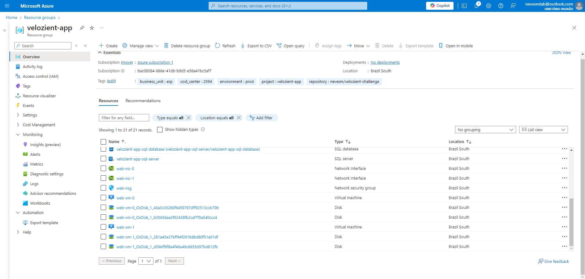

# Automate the deployment of a scalable web application in Azure using Terraform. 

### Infrastructure Requirements:
- A Virtual Network (VNet) with subnets for web, application, and database tiers. 
- Two Virtual Machines (VMs) in the web tier with a Load Balancer. 
- A VM in the application tier. 
- An Azure SQL Database in the database tier. 
- A Network Security Group (NSG) with appropriate rules for each tier. 

### Automation: 
- Write Terraform scripts to deploy the above infrastructure. 
- Ensure the infrastructure is highly available and scalable.

# Solution:

- Created a modular **terraform** script where you can:
    - Adjust vnet and subnet address CIDR freely, or create more subnets as you go.
    - Add more instances for App or Web through **`vm_pool`** variable.
    - Add a database administrator password securely with **`"random_password"`** resource, without exposing it to the repository and storing in a **`Azure KV`** so the application can retrieve later if necessary.
    - See the cost breakdown with **[Infracost](https://www.infracost.io/)** before deploying anything:
    

- Diagram generated by **Azure Resource Manager**:

- Resources in **Azure Portal**:

