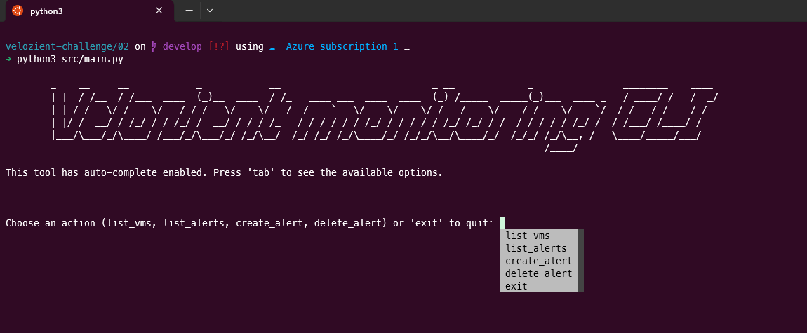

# Automate the setup of infrastructure monitoring and alerting for Azure resources using scripting and Azure Monitor.

## Requirements:
 - Write a script (using Python or PowerShell) that performs the following tasks: 
 - Sets up monitoring for a Virtual Machine in Azure. 
 - Configures metrics (CPU usage, memory usage) and logs collection. 
 - Sets up alerts for specified thresholds (e.g., CPU usage > 80%).

## Automation:
- Ensure the script can create or update the monitoring setup without manual intervention.
- Implement functionality to list all active alerts and their statuses.

# Solution:
I came up with a minimal python CLI tool to satisfy the requirements, you can:
- List virtual machines
- List Alerts
- Create Alerts (metric and activity_logs)
- Delete Alerts (metric and activity_logs)

**Considerations**: Due to the lack of time to carry out this test, I was unable to perfect the tool and I will leave some details below about how I would do it if I had more time:
- Decoupling code into more files to make it more readable.
- Option to edit an existing alarm.
- Quick alarm templates.
- Unitary tests.
- Release of a binary to more productivity when executing.


## How to use:
- Assuming you already have Python 3.10 installed:
```
git clone https://github.com/nevesm/velozient-challenge.git
cd veloizent-challenge/02
pip install -r requirements.txt
```
- Edit the src/main.py at line 12 with your subscription_id (I would love to automate this part but the time is short)
```
subscription_id = 'you-subscription-id'
```
- Run `python3 src/main.py`
- The CLI is intuitive and have auto-complete all over the place, enjoy ;)

## Demo

- Starting screen:


- List all virtual machines:


- Creating `metric_alert` and listing it:


- Creating a `activity_log_alert`, listing all and then deleting the metric alert:
